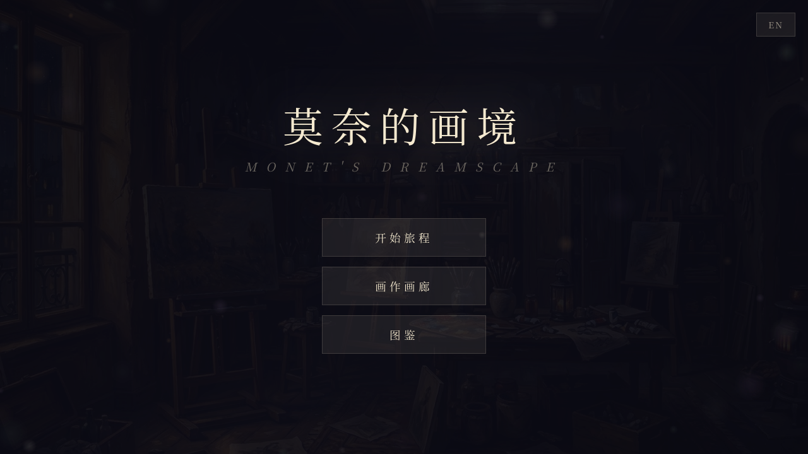
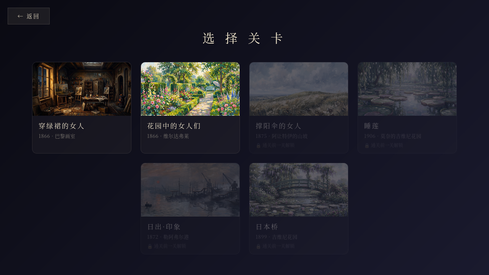
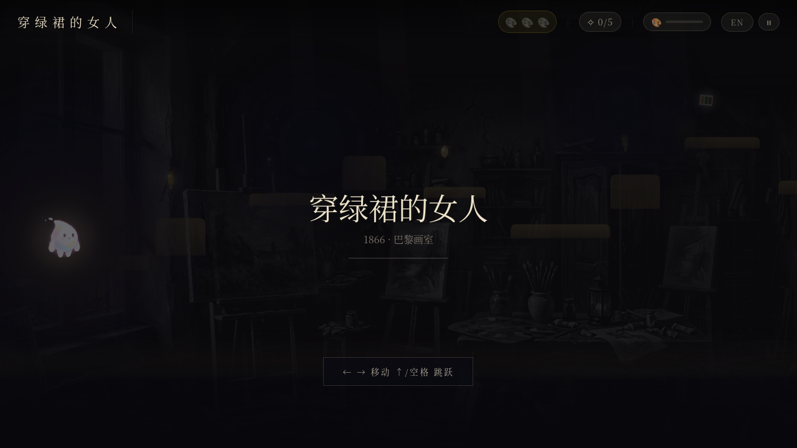
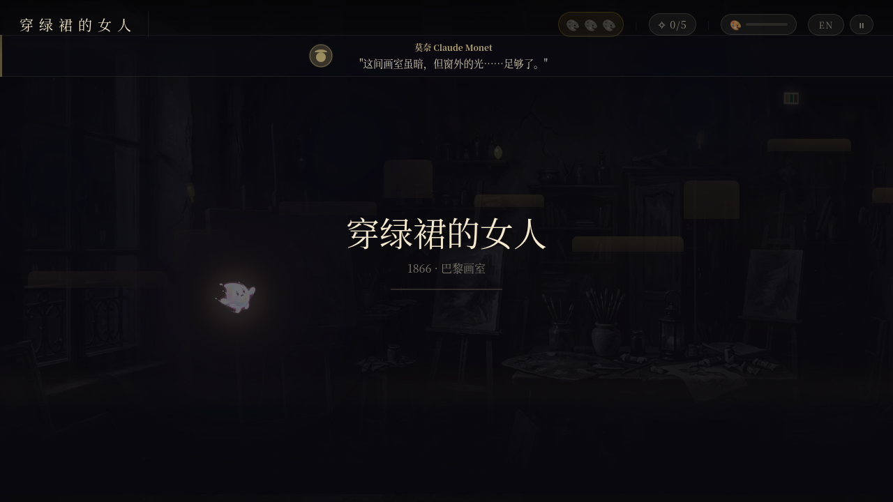
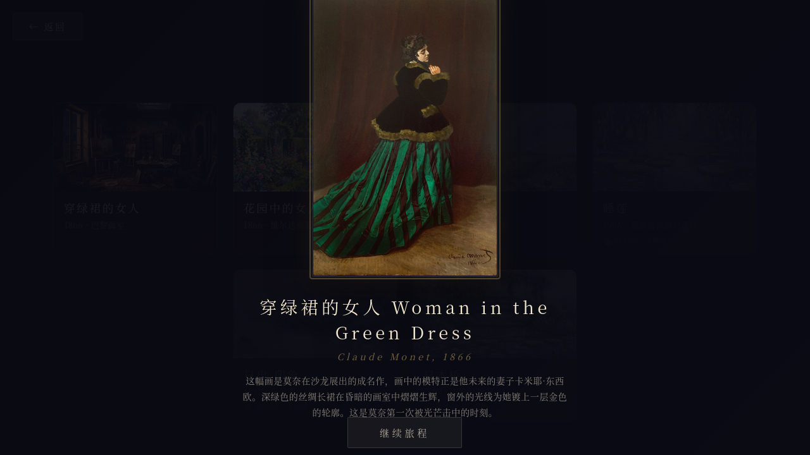
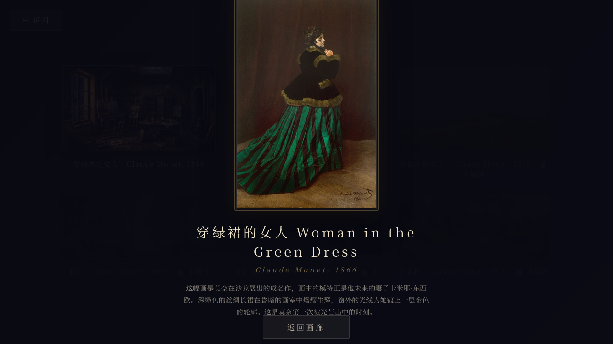

# Monet's Dreamscape / 莫奈的画境

An impressionist-style side-scrolling platformer built entirely with HTML5 Canvas. Explore six paintings by Claude Monet, collect hidden treasures, and uncover the love story between Monet and Camille Doncieux.

**[Play Now](https://s85m9uuq.mule.page/)** | [中文文档](README_zh.md)



---

## About

Players control a luminous spirit navigating through worlds crafted from Monet's real paintings. Each level features a unique gameplay mechanic inspired by the painting's theme — from lantern-lit studios to wind-swept gardens to parasol gliding across hilltops.

The game tells the chronological love story of Claude Monet and Camille Doncieux through voiced dialogue (English TTS with bilingual subtitles), progressing from their first meeting in a Paris studio to Monet's later years at Giverny.

## Screenshots

| Level Select | Gameplay |
|:---:|:---:|
|  |  |

| Voiceover & Exploration | Painting Reveal |
|:---:|:---:|
|  |  |

| Gallery | Gallery Detail |
|:---:|:---:|
|  |  |

## The Six Levels

| # | Painting | Year | Mechanic |
|---|----------|------|----------|
| 1 | Woman in the Green Dress | 1866 | **Light & Shadow** — Player carries a lantern; dark zones hide platforms until illuminated |
| 2 | Women in the Garden | 1866 | **Wind Gusts** — Periodic wind pushes the player and sways platforms |
| 3 | Woman with a Parasol | 1875 | **Parasol Glide** — Hold jump to glide; updraft zones launch player upward |
| 4 | Water Lilies | 1906 | **Disappearing Lily Pads** — Platforms fade after standing on them |
| 5 | Impression, Sunrise | 1872 | **Tidal Cycle** — Water rises and falls, submerging lower platforms |
| 6 | The Japanese Bridge | 1899 | **Season Shift** — Environment transitions through spring, summer, and autumn |

## Controls

| Key | Action |
|-----|--------|
| `Arrow Left/Right` or `A/D` | Move |
| `Arrow Up` / `Space` / `W` | Jump (hold to glide in Level 3) |
| `ESC` | Pause / Resume |
| `Tab` / `B` | Open Backpack |

Touch controls are displayed automatically on mobile devices.

## Features

- **6 levels** based on real Monet paintings, each with a unique gameplay mechanic
- **Bilingual** — Chinese/English toggle (menu + in-game)
- **Voiced dialogue** between Monet and Camille (42 voice lines, English TTS + bilingual subtitles)
- **Progressive painting reveal** — Background transforms from grayscale sketch to full color as items are collected
- **Procedural music** — Generated in real-time via Web Audio API (no audio files needed)
- **Collectibles** — 3 paint tube keys + 5 souvenirs per level, with persistent album
- **Painting gallery** — View unlocked masterworks with descriptions
- **AI-generated sprites** — 8-frame character animation with runtime background removal
- **3-layer parallax** scrolling with atmospheric effects (fog, light beams, vignette, noise)
- **Mobile-friendly** — Responsive layout with virtual touch controls

## Tech Stack

| Component | Technology |
|-----------|-----------|
| Rendering | HTML5 Canvas 2D API |
| Audio | Web Audio API (procedural generation) |
| Voice | edge-tts (Microsoft Edge TTS) |
| Art Assets | MuleRouter API / AI image generation |
| Persistence | localStorage |
| Deployment | Static files — no server required |

## Project Structure

```
src/
├── index.html              # HTML structure and UI elements
├── style.css               # Styles with z-index layer management
├── game.js                 # Game engine (~4800 lines, single-file architecture)
├── water_lilies.jpg        # Level 4 background
├── impression_sunrise.jpg  # Level 5 background
├── japanese_bridge.jpg     # Level 6 background
├── green_dress.jpg         # Level 1 background
├── women_garden.jpg        # Level 2 background
├── parasol.jpg             # Level 3 background
├── sprite_sheet_v3.png     # 8-frame character sprite (idle, walk, jump, fall)
├── vo/                     # Voice-over audio (42 MP3 files)
│   ├── l1_v1.mp3 ~ l1_v6.mp3    # Level 1 dialogue
│   ├── l2_v1.mp3 ~ l2_v6.mp3    # Level 2 dialogue
│   ├── ...
│   └── l6_v1.mp3 ~ l6_v6.mp3    # Level 6 dialogue
├── souvenirs/              # Souvenir collectible images (30 JPGs)
│   ├── sv_l1_1.jpg ~ sv_l1_5.jpg
│   ├── ...
│   └── sv_l6_1.jpg ~ sv_l6_5.jpg
└── paintings/              # High-res painting images for reveal (6 JPGs)
    ├── painting_l1.jpg ~ painting_l6.jpg
```

## Running Locally

The game is pure static files with no build step:

```bash
# Python
cd src && python3 -m http.server 8080

# Node.js
cd src && npx serve .

# Then open http://localhost:8080
```

## Architecture Highlights

### Single-File Game Engine
The entire game logic lives in `game.js` — physics, rendering, level data, i18n, audio, UI state management. This was a deliberate choice for zero-dependency deployment on static hosting platforms.

### Sprite Processing Pipeline
AI-generated character sprites have black backgrounds. A two-pass runtime pipeline handles this:
1. **Pass 1**: Scan all frames to find content bounding boxes, compute maximum uniform dimensions
2. **Pass 2**: Extract each frame centered in uniform canvas, remove dark pixels with gradient alpha falloff

This ensures all animation frames share identical dimensions, preventing size jitter during state transitions.

### Progressive Painting System
Three reveal modes add visual variety across levels:
- **Global Fade** — Entire background desaturates→saturates via CSS filter
- **Radial Spread** — Color radiates outward from each collection point
- **Layer Reveal** — Horizontal bands reveal bottom-to-top

### Procedural Music
No music files are shipped. The Web Audio API generates ambient music in real-time:
- Layer 1: Chord pad (sustained harmonic foundation)
- Layer 2: Pentatonic melody (randomly generated)
- Layer 3: Bass (chord root notes)
- Layer 4: Filtered white noise texture

## Design Philosophy

The visual design draws from museum aesthetics — warm parchment tones (#f5ead0) for text, deep gallery blacks (#0a0a12) for backgrounds. Georgia serif typography echoes classical art catalogues. Liberal use of transparency and blur filters recreates the luminous quality of Impressionist painting.

The narrative follows the real chronology of Monet and Camille's relationship, grounding the platforming mechanics in emotional context rather than arbitrary challenge progression.

## Development Journey

This project was developed entirely through AI-assisted programming — from concept to deployment, across 35 iterative versions. Below is a detailed account of the development process, the problems encountered, and how they were solved.

### Phase 1: Prototype (V1–V5)

**Goal**: Get a playable single-level platformer running in the browser.

The project started with a simple premise: what if you could *walk inside* a Monet painting? The first version was a minimal HTML5 Canvas game with:
- A single level (Water Lilies) with static platforms
- A procedurally drawn character (colored rectangles)
- Basic left/right movement and gravity
- A single background image

**Key decision**: Everything was put into a single `game.js` file from the start. This wasn't laziness — the game needed to deploy on static hosting platforms (specifically mule.page) that strip inline scripts and styles. A single external JS file was the most reliable approach.

**V3–V5** added the core game loop: collectible paint tubes as "keys" to unlock level gates, a simple HUD, and collision detection. The physics system went through several iterations — early versions had the player sliding off platforms or falling through them at high speeds. The fix was to check collisions in smaller substeps when velocity was high.

### Phase 2: Three Levels & Audio (V6–V12)

**Goal**: Expand to three levels with distinct atmospheres, add music and voiceover.

Three Monet paintings were chosen for the initial release:
1. *Water Lilies* (1906) — horizontal, serene, floating platforms
2. *Impression, Sunrise* (1872) — harbor scene, boats as platforms
3. *The Japanese Bridge* (1899) — vertical garden, bridge as centerpiece

**Background art** was generated using MuleRouter API (Google Nano Banana model) — each painting was used as a style reference to generate wide panoramic backgrounds in that painting's palette and brushstroke style.

**Procedural music** was a deliberate choice over pre-recorded audio. The Web Audio API generates ambient music in real-time using four layers (chord pad, pentatonic melody, bass, filtered noise). This eliminated the need for music files entirely and kept the deployment lightweight. Each level has its own key signature and tempo to match its mood.

**Voiceover** was generated using edge-tts (Microsoft Edge TTS, free, no API key required). The dialogue tells the story of Monet and Camille through position-triggered voice lines — as the player walks through the level, they hear conversations between the couple. English voice acting with bilingual subtitles (Chinese/English).

**i18n system** was built from scratch — a flat key-value dictionary with `t('key')` lookups, supporting runtime language switching. Every piece of UI text, voiceover subtitle, and item name goes through this system.

### Phase 3: Polish & Systems (V13–V20)

**Goal**: Add collection mechanics, UI polish, and the souvenir album.

This phase focused on making the game feel complete:

- **Souvenir system**: 5 optional collectibles per level (palette knives, brushes, letters, flowers). Each is an AI-generated image with a name and description. Collected items persist in localStorage and appear in the album.
- **Backpack UI**: Press Tab/B to see current level's collected items in a slide-out drawer.
- **Painting reveal**: When a level is completed, the original Monet painting is displayed with title, artist, year, and description. This serves as both a reward and an art education moment.
- **Pause system**: ESC pauses the game with a frosted glass overlay. Resume, return to menu, or restart.
- **3-layer parallax**: Background, midground, and foreground layers scroll at different speeds, creating depth. Combined with animated fog, light beams, vignette, and noise grain for atmosphere.
- **Mobile controls**: Virtual D-pad and jump button, auto-detected on touch devices.

### Phase 4: Expansion to 6 Levels (V21–V28)

**Goal**: Tell the complete Monet-Camille story across 6 chronologically ordered levels.

The original 3 levels covered Monet's later Giverny period. To tell the full love story, 3 new earlier-period levels were added and the order was rearranged:

| New Order | Painting | What Was Added |
|-----------|----------|----------------|
| L1 (new) | Woman in the Green Dress, 1866 | **Light & shadow mechanic** — player carries a lantern, platforms outside light radius are invisible |
| L2 (new) | Women in the Garden, 1866 | **Wind mechanic** — periodic gusts push the player, platforms sway |
| L3 (new) | Woman with a Parasol, 1875 | **Parasol glide** — hold jump to float, updraft zones for vertical movement |
| L4 (was L1) | Water Lilies, 1906 | Added disappearing lily pad platforms |
| L5 (was L2) | Impression, Sunrise, 1872 | **Tidal mechanic** — water rises/falls on 12-second cycle |
| L6 (was L3) | The Japanese Bridge, 1899 | **Season shift** — background transitions spring→summer→autumn |

Each new level required:
- Background image generation (MuleRouter API)
- 7 voiceover lines (edge-tts) + bilingual subtitles
- 5 souvenir images (AI-generated)
- High-res painting image for the completion reveal
- Level layout data (platforms, collectible positions, trigger zones)
- Unique mechanic implementation

**New platform types**: 10 new types were added — `easel`, `shelf`, `frame` (studio furniture for L1), `hedge`, `bench`, `branch` (garden elements for L2), `grass`, `cloud`, `kite` (hilltop elements for L3), `tidal` (water-affected for L5).

**Progressive painting system**: Background starts as grayscale sketch and transforms into full color as items are collected. Three visual modes for variety:
- *Global Fade*: entire background desaturates→saturates (L2, L5, L6)
- *Radial Spread*: color radiates outward from each collection point like ink in water (L1, L4)
- *Layer Reveal*: horizontal bands reveal bottom-to-top (L3)

**Voiceover queue fix**: Position-triggered dialogue could fire while another line was still playing, causing overlap. Added a `busy` flag and pending queue — new triggers wait until the current line finishes before playing.

### Phase 5: Character Sprites & Gallery (V29–V34)

**Goal**: Replace procedural character with AI-generated sprites, add painting gallery.

The original character was drawn procedurally (colored rectangles with a glow effect). While functional, it felt disconnected from the impressionist art style.

**AI sprite generation**: Used MuleRouter API (Google Nano Banana 2 Edit model) to generate 8 character pose frames:
- idle, idle_look — standing poses
- walk_a, walk_b — two walk cycle frames
- jump_crouch, jump_apex — jump launch and peak
- fall, landing — falling and touchdown

These were composited into a single sprite sheet (`sprite_sheet_v3.png`, 2048x571).

**The black background problem**: AI-generated sprites came with black backgrounds. A runtime pixel-processing pipeline was built to handle this:
1. Pass 1: Scan all 8 frames, find content bounding boxes, compute maximum uniform canvas size
2. Pass 2: Center each frame in the uniform canvas, remove dark pixels with gradient alpha falloff (brightness < 25 → transparent, 25-60 → gradual fade)

This two-pass approach was critical — early versions processed each frame independently, causing different bounding box sizes. The character would "shrink" during jumps because the jump frame had a different aspect ratio than the walk frame. Uniform normalization fixed this.

**Cross-fade animation**: State transitions (idle→walk, walk→jump, etc.) use a 250ms cross-fade between the previous and current frame, preventing jarring instant switches.

**Painting gallery**: A new menu section showing all 6 paintings as cards. Unlocked paintings can be clicked to view the full artwork with title and description. Locked paintings show a dimmed preview with a lock icon.

**Gallery mode isolation bug**: Clicking a painting in the gallery used the same overlay as the level-completion reveal. The "Continue" button's event listener would trigger `closePaintingReveal()`, which starts the next level — so clicking a gallery painting would accidentally start a game level. Fixed by adding a `_galleryMode` flag: when true, the close handler returns to the gallery instead of advancing levels.

### Phase 6: Painting Reveal Redesign (V34–V35)

**Goal**: Fix black bars around paintings in the reveal overlay.

The painting reveal went through 3 design iterations:

1. **V31**: Fixed-size container with `object-fit: cover` — cropped tall paintings to show only the bottom half. Unusable.
2. **V33**: Adaptive layout with `object-fit: contain` — preserved aspect ratio but showed black background bars around non-matching paintings. The user explicitly said "不喜欢黑边" (don't like black bars).
3. **V35 (final)**: Painting-centric approach — the image drives the container size. `max-height: 62vh; max-width: 80vw; width: auto; height: auto` with transparent background. Golden frame effect via CSS pseudo-elements. No fixed container, no black bars.

The overlay uses `backdrop-filter: blur(24px)` on a dark semi-transparent background, with the painting entering via a `scale(1.08)→scale(1)` animation on a cubic-bezier curve.

### Deployment Pipeline

The game deploys to mule.page (static hosting) via a Python script (`deploy_v2.py`) that:
1. Initializes an MCP session with the hosting API
2. Creates a new version (V1, V2, ..., V35)
3. Gets presigned upload tokens for each file
4. Uploads all 90 files (HTML, CSS, JS, images, audio)
5. Publishes the version
6. Verifies the deployment by fetching the live page

Each deployment takes about 2 minutes for 90 files. The script includes verification — it checks that v2-specific HTML elements exist in the live page response.

### Automated Testing

Throughout development, Playwright browser automation was used to verify each deployment:
- Navigate to the live URL
- Take screenshots of menu, level select, gameplay
- Programmatically start levels and trigger events (painting reveals, gallery views)
- Check for JavaScript console errors
- Verify visual regressions by comparing screenshots

### Version History Summary

| Versions | Milestone |
|----------|-----------|
| V1–V5 | Single-level prototype with basic physics |
| V6–V8 | Three levels, procedural music |
| V9–V12 | Voiceover system, i18n, mobile controls |
| V13–V17 | Souvenirs, backpack, painting reveal |
| V18–V20 | Pause system, parallax, visual effects |
| V21–V25 | 3 new levels, unique mechanics per level |
| V26–V28 | Progressive painting system, VO queue fix |
| V29–V31 | AI sprites, gallery, album system |
| V32–V33 | Sprite normalization, adaptive painting reveal |
| V34–V35 | Gallery isolation fix, painting-centric reveal |

### Lessons Learned

1. **Single-file architecture scales surprisingly well** for this type of project. At ~4800 lines, `game.js` is large but navigable. The tradeoff of no build step and instant deployment is worth it for a game this size.

2. **AI-generated assets need runtime processing**. You can't just use AI art directly — black backgrounds, inconsistent sizes, and varying quality all need programmatic handling. The two-pass sprite pipeline was the most complex piece of asset processing.

3. **Iterative deployment is essential**. With 35 versions deployed and tested live, bugs were caught in real browser environments rather than just local testing. The automated deploy + verify pipeline made this feasible.

4. **Progressive disclosure keeps players engaged**. The grayscale-to-color painting reveal gives a tangible sense of progress beyond just "collect all items." Players are literally painting the masterwork back into existence.

5. **Narrative grounding transforms gameplay**. The same platforming mechanics feel very different when contextualized within a love story. Collecting items in a dark studio *because Monet is painting Camille for the first time* creates emotional investment that pure gameplay cannot.

## License

This project is for educational and artistic purposes. Painting imagery is based on public domain works by Claude Monet (1840–1926). AI-generated assets were created using MuleRouter API.

---

*Built with HTML5 Canvas, Web Audio API, and a love for Impressionism.*
